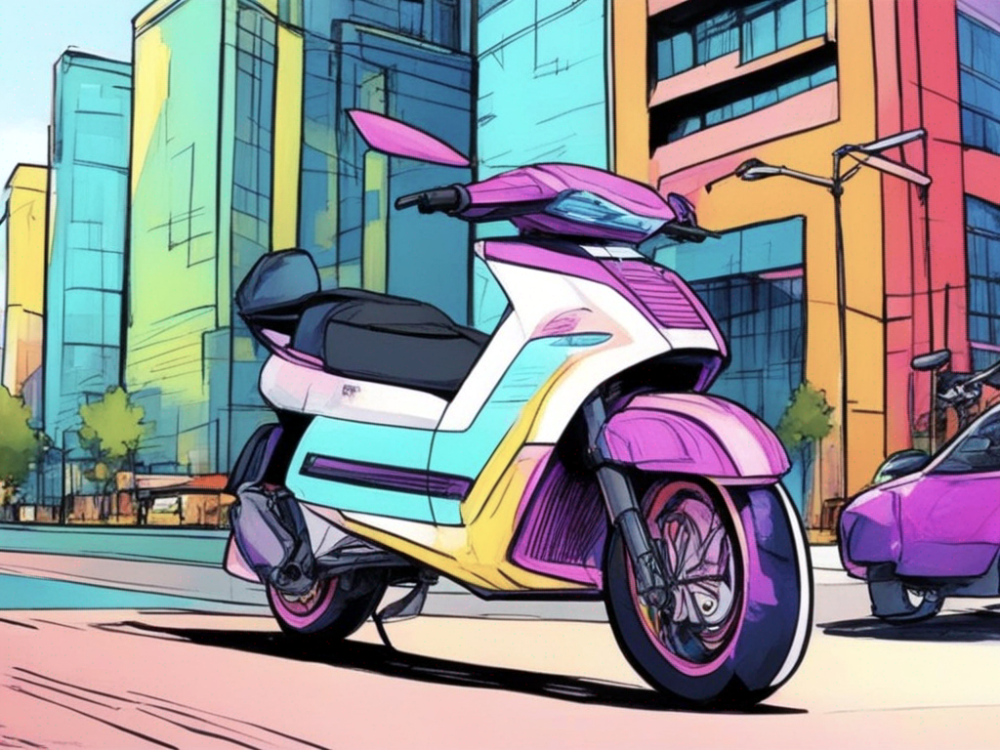
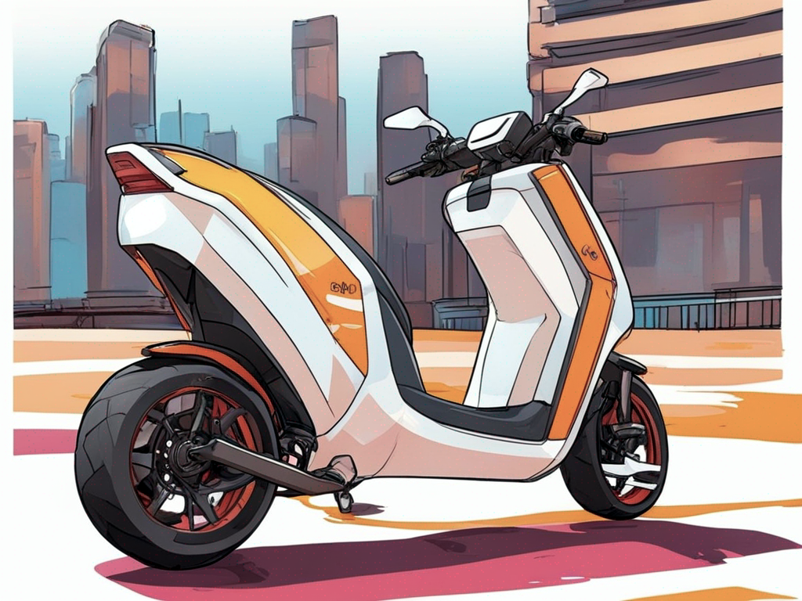
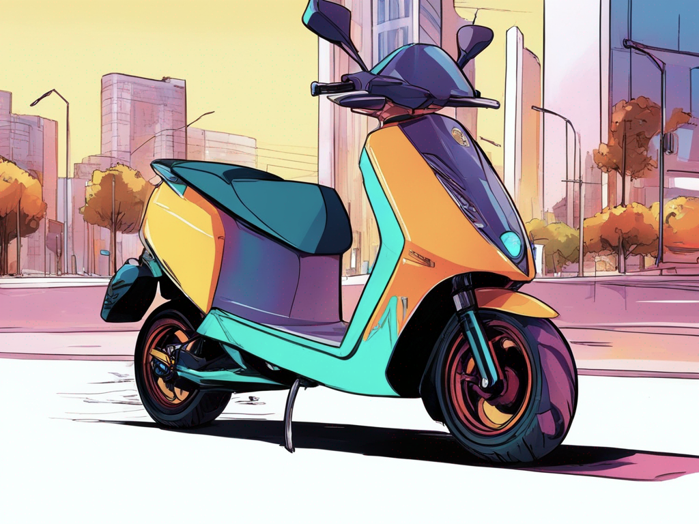
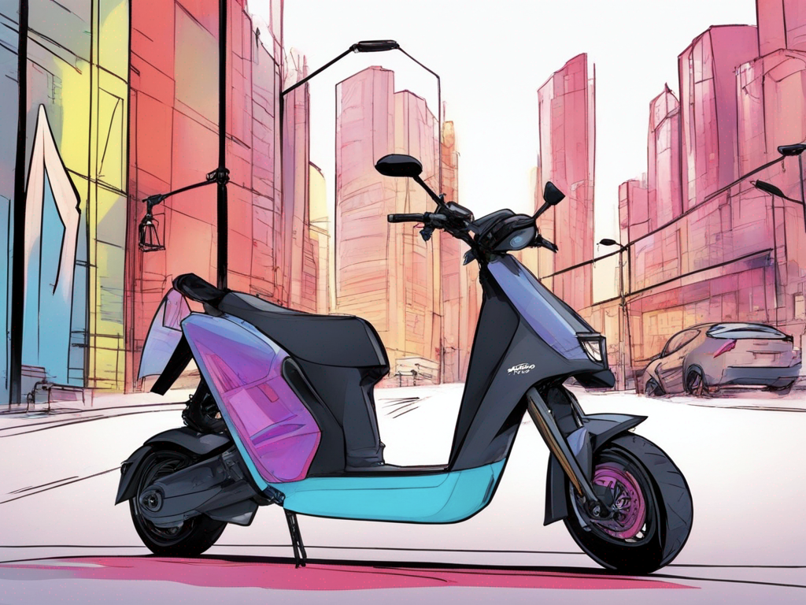
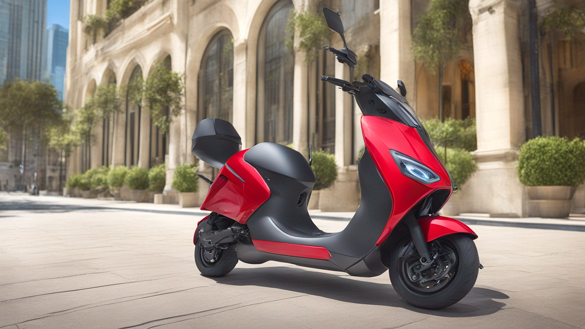
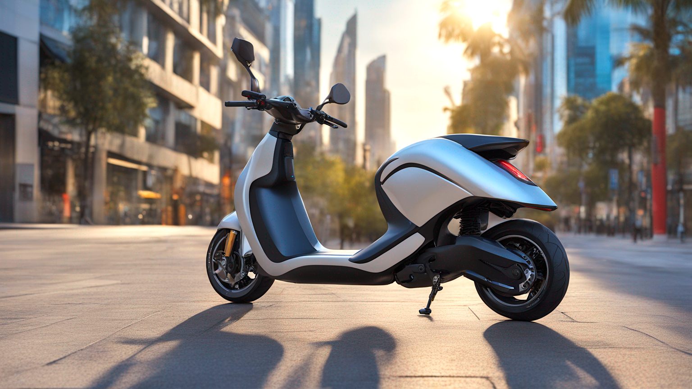

# Fine-tuning Stable Diffusion XL on AWS for Generative AI-powered Product Concept Design

Source code files for the blog post: [Fine-tuning Stable Diffusion XL on AWS for Generative AI-powered Product Concept Design](https://garystafford.medium.com/fine-tuning-stable-diffusion-xl-on-aws-for-generative-ai-powered-product-concept-design-dae6f4c8c8fa). For more information, see the blog post. The SageMaker notebook, [SDXL_AutoTrain_DreamBooth.ipynb](SDXL_AutoTrain_DreamBooth.ipynb) contains all the code demonstrated in the post.

## LoRA Weights

To use the PyTorch LoRA weights with the SDXL 1.0 model, unzip the `mb_amg_gt_oue_dreambooth.zip` file. The resulting `mb_amg_gt_oue_dreambooth` and inclosed `pytorch_lora_weights.safetensors` file can be used with the SDXL 1.0 base model. The model was fine-tuned with approximately 20 images, each scaled in the longest dimension to 1024 pixels.

## Sample Concept Images

All of the images shown below are unretouched.

### Test of the Fine-tuned Model to Generate `oue car` Images

The photorealistic images below were generated using the following prompts at 768 x 1024 pixels wide:

```python
subject_prompt = subject_prompt = """oue, photo of oue car, sporty, fast, sleek, sexy, aggressive, high performance, daytime, futuristic cityscape"""

subject_negative_prompt = """person, people, human, rider, floating objects, text, words, writing, letters, phrases, trademark, watermark, icon, logo, banner, signature, username, monochrome, cropped, cut-off"""

refiner_prompt = """ultra-high-definition, photorealistic, 8k uhd, high-quality, ultra sharp detail"""

refiner_negative_prompt = """low quality, low-resolution, out of focus, blurry, grainy, artifacts, defects, jpeg artifacts, noise"""
```

<table border="0" cellspacing="10" cellpadding="10">
    <tr>
        <td>
            
        </td>
        <td>
            
        </td>
        <td>
            
        </td>
    </tr>
    <tr>
        <td>
            
        </td>
        <td>
            
        </td>
        <td>
            
        </td>
    </tr>
    <tr>
        <td>
            
        </td>
        <td>
            
        </td>
        <td>
            
        </td>
    </tr>
</table>

### Rough Product Sketches of `oue electric scooter`

The rough product sketches below were generated using the following prompts at 768 x 1024 pixels wide:

```python
subject_prompt = """oue, marker rendering of oue electric scooter, concept art, futuristic cityscape, high contrast, black and white, black marker, marker drawing, sketch, monochromatic illustration, illustrative, graphic, muted, expressive strokes"""

subject_negative_prompt = """person, people, human, rider, floating objects, colors, text, words, writing, letters, phrases, trademark, watermark, icon, logo, banner, signature, username, cropped, cut-off, patterned background"""

refiner_prompt = """sharp, crisp, in-focus, uncropped, high-quality"""

refiner_negative_prompt = """photographic, photo, photorealistic, low quality, low-resolution, out of focus, blurry, grainy, artifacts, defects, jpeg artifacts, noise"""
```

<table border="0" cellspacing="10" cellpadding="10">
    <tr>
        <td>
            
        </td>
        <td>
            
        </td>
        <td>
            
        </td>
    </tr>
    <tr>
        <td>
            
        </td>
        <td>
            
        </td>
        <td>
            
        </td>
    </tr>
    <tr>
        <td>
            
        </td>
        <td>
            
        </td>
        <td>
            
        </td>
    </tr>
</table>

### Color Marker Renderings of `oue electric scooter`

The color marker renderings below were generated using the following prompts:

```python
subject_prompt = """oue, color marker rendering of oue electric scooter, concept art, sporty, fast, sleek, sexy, aggressive, high performance, colors, urban, futuristic cityscape, marker, sketch, black and white lines, illustration, illustrative, marker drawing, expressive strokes, graphic"""

subject_negative_prompt = """person, people, human, rider, floating objects, text, words, writing, letters, phrases, trademark, watermark, icon, logo, banner, signature, username, monochrome, cropped, cut-off, patterned background, doubles, repeat elements"""

refiner_prompt = """sharp, crisp, in-focus, uncropped, high-quality"""

refiner_negative_prompt = """photographic, photo, photorealistic, low quality, low-resolution, out of focus, blurry, grainy, artifacts, defects, jpeg artifacts, noise"""
```

<table border="0" cellspacing="10" cellpadding="10">
    <tr>
        <td>
            
        </td>
        <td>
            
        </td>
        <td>
            
        </td>
    </tr>
    <tr>
        <td>
            
        </td>
        <td>
            
        </td>
        <td>
            
        </td>
    </tr>
    <tr>
        <td>
            
        </td>
        <td>
            
        </td>
        <td>
            
        </td>
    </tr>
</table>

Additional variations of color marker renderings generated with the latest LoRA weights and the following prompts at 768 x 1024 pixels wide:

```python
subject_prompt = """oue, marker rendering of oue electric scooter, concept art, futuristic cityscape, solid color background, bright vibrant colors, marker, sketch, illustration, illustrative, marker drawing, expressive strokes, graphic"""

subject_negative_prompt = """person, people, human, rider, floating objects, text, words, writing, letters, phrases, trademark, watermark, icon, logo, banner, signature, username, monochrome, cropped, cut-off, patterned background"""

refiner_prompt = """sharp, crisp, in-focus, uncropped, high-quality"""

refiner_negative_prompt = """photographic, photo, photorealistic, low quality, low-resolution, out of focus, blurry, grainy, artifacts, defects, jpeg artifacts, noise"""
```

<table border="0" cellspacing="10" cellpadding="10">
    <tr>
        <td>
            
        </td>
        <td>
            
        </td>
        <td>
            
        </td>
    </tr>
    <tr>
        <td>
            
        </td>
        <td>
            
        </td>
         <td>
            
        </td>
    </tr>
    <tr>
        <td>
            
        </td>
        <td>
            
        </td>
        <td>
            
        </td>
    </tr>
</table>

### Photorealistic Images of `oue electric scooter`

The photorealistic images below were generated using the following prompts at 864 x 1536 pixels wide (LinkedIn size):

```python
subject_prompt = """oue, photo of a oue electric scooter, sleek, smooth curves, colorful, daytime, urban, futuristic cityscape"""

subject_negative_prompt = """person, people, human, rider, floating objects, text, words, writing, letters, phrases, trademark, watermark, icon, logo, banner, signature, username, monochrome, cropped, cut-off, patterned background"""

refiner_prompt = """ultra-high-definition, photorealistic, 8k uhd, high-quality, ultra sharp detail"""

refiner_negative_prompt = """low quality, low-resolution, out of focus, blurry, grainy, artifacts, defects, jpeg artifacts, noise"""
```

<table border="0" cellspacing="10" cellpadding="10">
    <tr>
        <td>
            
        </td>
        <td>
            
        </td>
        <td>
            
        </td>
    </tr>
    <tr>
        <td>
            
        </td>
        <td>
            
        </td>
        <td>
            
        </td>
    </tr>
</table>

Additional photorealistic images generated with the latest LoRA weights and the following prompts at 768 x 1024 pixels wide:

```python
subject_prompt = """oue, photo of a oue electric scooter, sleek, smooth curves, colorful, daytime, urban, futuristic cityscape"""

subject_negative_prompt = """person, people, human, rider, floating objects, text, words, writing, letters, phrases, trademark, watermark, icon, logo, banner, signature, username, monochrome, cropped, cut-off, patterned background"""

refiner_prompt = """ultra-high-definition, photorealistic, 8k uhd, high-quality, ultra sharp detail"""

refiner_negative_prompt = """low quality, low-resolution, out of focus, blurry, grainy, artifacts, defects, jpeg artifacts, noise"""
```

<table border="0" cellspacing="10" cellpadding="10">
    <tr>
        <td>
            
        </td>
        <td>
            
        </td>
        <td>
            
        </td>
    </tr>
    <tr>
        <td>
            
        </td>
        <td>
            
        </td>
        <td>
            
        </td>
    </tr>
    <tr>
        <td>
            
        </td>
        <td>
            
        </td>
        <td>
            
        </td>
    </tr>
</table>
