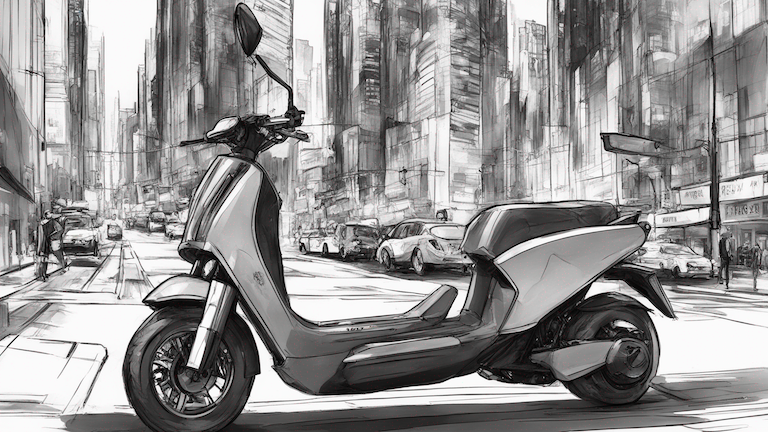

# Fine-tuning Stable Diffusion XL on AWS for Generative AI-powered Product Concept Design

Source code files for the blog post: [Fine-tuning Stable Diffusion XL on AWS for Generative AI-powered Product Concept Design](https://garystafford.medium.com/fine-tuning-stable-diffusion-xl-on-aws-for-generative-ai-powered-product-concept-design-dae6f4c8c8fa). For more information, see the blog post. The SageMaker notebook, [SDXL_AutoTrain_DreamBooth.ipynb](SDXL_AutoTrain_DreamBooth.ipynb) contains all the code demonstrated in the post.

## LoRA Weights

To use the PyTorch LoRA weights with the SDXL 1.0 model, unzip the `./amg_gt_oue_dreambooth/pytorch_lora_weights.safetensors.zip` file. The resulting `pytorch_lora_weights.safetensors` file should be placed in the `sdxl_dreambooth_autotrain_demo/amg_gt_oue_dreambooth` directory.

## Sample Concept Images

### Rough Product Sketches

The rough product sketches below were generated using the following prompts:

```python
subject_prompt = """oue, marker rendering of oue electric scooter, concept art, futuristic cityscape, high contrast, black and white, black marker, marker drawing, sketch, monochromatic illustration, illustrative, graphic, muted, expressive strokes"""

subject_negative_prompt = """person, people, human, rider, floating objects, colors, text, words, writing, letters, phrases, trademark, watermark, icon, logo, banner, signature, username, cropped, cut-off, patterned background"""

refiner_prompt = """sharp, crisp, in-focus, uncropped, high-quality"""

refiner_negative_prompt = """photographic, photo, photorealistic, low quality, low-resolution, out of focus, blurry, grainy, artifacts, defects, jpeg artifacts, noise"""
```

<table border="0" cellspacing="10" cellpadding="10">
    <tr>
        <td>
            
        </td>
        <td>
            
        </td>
    </tr>
    <tr>
        <td>
            
        </td>
        <td>
            
        </td>
    </tr>
    <tr>
        <td>
            
        </td>
        <td>
            
        </td>
    </tr>
    <tr>
        <td>
            
        </td>
        <td>
            
        </td>
    </tr>
</table>

### Color Marker Renderings

The color marker renderings below were generated using the following prompts:

```python
subject_prompt = """oue, color marker rendering of oue electric scooter, concept art, sporty, fast, sleek, sexy, aggressive, high performance, colors, urban, futuristic cityscape, marker, sketch, black and white lines, illustration, illustrative, marker drawing, expressive strokes, graphic"""

subject_negative_prompt = """person, people, human, rider, floating objects, text, words, writing, letters, phrases, trademark, watermark, icon, logo, banner, signature, username, monochrome, cropped, cut-off, patterned background, doubles, repeat elements"""

refiner_prompt = """sharp, crisp, in-focus, uncropped, high-quality"""

refiner_negative_prompt = """photographic, photo, photorealistic, low quality, low-resolution, out of focus, blurry, grainy, artifacts, defects, jpeg artifacts, noise"""
```

<table border="0" cellspacing="10" cellpadding="10">
    <tr>
        <td>
            
        </td>
        <td>
            
        </td>
    </tr>
    <tr>
        <td>
            
        </td>
        <td>
            
        </td>
    </tr>
    <tr>
        <td>
            
        </td>
        <td>
            
        </td>
    </tr>
    <tr>
        <td>
            
        </td>
        <td>
            
        </td>
    </tr>
</table>

### Photorealistic Images

The photorealistic images below were generated using the following prompts:

```python
subject_prompt = """oue, photo of a oue electric scooter, sleek, smooth curves, colorful, daytime, urban, futuristic cityscape"""

subject_negative_prompt = """person, people, human, rider, floating objects, text, words, writing, letters, phrases, trademark, watermark, icon, logo, banner, signature, username, monochrome, cropped, cut-off, patterned background"""

refiner_prompt = """ultra-high-definition, photorealistic, 8k uhd, high-quality, ultra sharp detail"""

refiner_negative_prompt = """low quality, low-resolution, out of focus, blurry, grainy, artifacts, defects, jpeg artifacts, noise"""
```

<table border="0" cellspacing="10" cellpadding="10">
    <tr>
        <td>
            
        </td>
        <td>
            
        </td>
    </tr>
    <tr>
        <td>
            
        </td>
        <td>
            
        </td>
    </tr>
    <tr>
        <td>
            
        </td>
        <td>
            
        </td>
    </tr>
</table>
